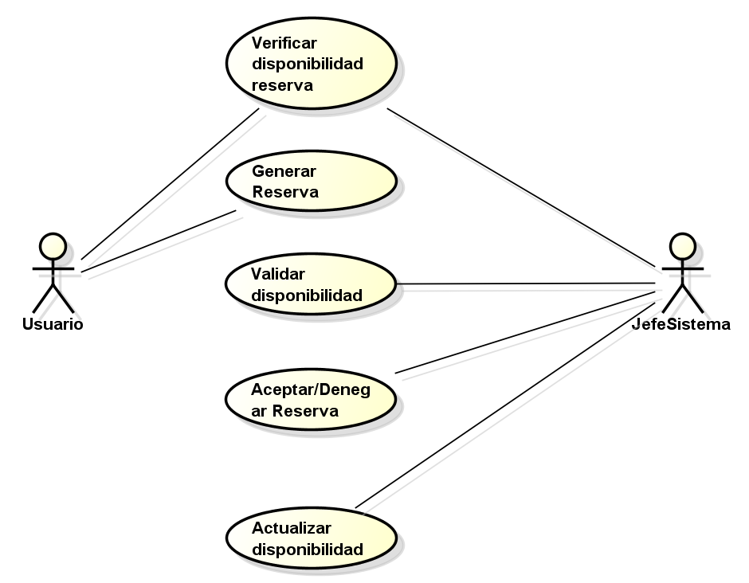

# 📄 Requerimientos del Sistema

## 1. Lista general de requerimientos

El sistema de SILABINFO tiene los siguientes requerimientos en la capacidad de cumplir:

1. Confirmar o denegar la reserva de los usuarios segun las reglas de cada tipo de recurso
2. Llevar una validación y disponibilidad actualizada sobre las diversas salas que pueden ser reservadas

### 2.1 Requerimiento Funcional 1

| Campo | Descripción |
|------|-------------|
| **ID** | RF-01 |
| **Nombre del requerimiento** | Confirmar o denegar las reservas de los usuarios |
| **Descripción** | El sistema debe poder decidir entre aceptar o denegar la solicitud de los usuarios con respecto a las reservas según los requerimientos necesarios para cada una de las salas disponibles para realizar tal acción|
| **Precondiciones** | Para que el sistema cumpla con este requerimiento, SILABINFO debe tener previamente la información del usuario, la sala a solicitar y el cargo que cumple el usuario, ademas de fecha y hora de la reserva junto al tiempo a utilizar la misma, los elementos necesarios de la sala y la cantidad de personas que entraran en la reserva|
| **Actor** | Usuario (monitor, estudiante, profesor) |
| **Flujo principal** | 1. El actor debe ingresar los datos de la reserva (los solicitados en las precondiciones)  2. el sistema verifica que las condiciones cuplan con los requerimientos para solicitar la sala  3. el sistema acepta o niega la solicitud|
| **Diagrama de caso de uso** |  |
| **Poscondiciones** | Se espera como resultado una confirmación de la solicitud o, una negación de la solicitud con un mensaje para intentarlo nuevamenete|

### 2.2 Requerimiento Funcional 2

| Campo | Descripción |
|------|-------------|
| **ID** | RF-02 |
| **Nombre del requerimiento** | validar la disponibilidad de las salas para reservar |
| **Descripción** | El sistema debe poder responder que salas estan disponibles para ser reservadas y que salas ya estan ocupadas en el mismo instante en el que se vaya a realizar la reserva |
| **Precondiciones** | Para que el sistema cumpla con este requerimiento, SILABINFO debe tener previamente la información de todas las salas que ya se reservaron hsata el momento en el que el usuario realiza la consulta y, ademas de eso, debe de contar con una actualización siclica de las mismas disponibilidades cada cierta cantidad de tiempo x por si se genera algún cambio en el sistema |
| **Actor** | Jefe del sistema |
| **Flujo principal** | 1. El actor ingresa a validar las disponibilidades de las salas en el sistema  2. El sistema responde con el conjunto de salas disponibles para reservar 3. El sistema se actualiza cada x tiempo por si hay alguna nueva reserva/disponibilidad generada |
| **Diagrama de caso de uso** |  |
| **Poscondiciones** | Se espera como resultado la lista de todas aquellas salas disponibles para reservarse en tiempo real |
