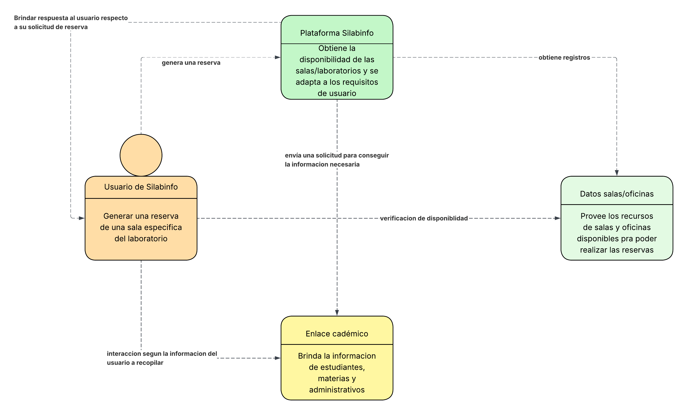

# DOSW-ParcialT1-KarolRodriguez
---
## PUNTO 1
El diagrama de contexto generado para este caso de estudio es el siguiente:

En el cual, nos centramos en las funcionalidades generales de las que debe de encargarse en sistema completo para cumplir con las espectativas originadas por los usuarios funcionales
